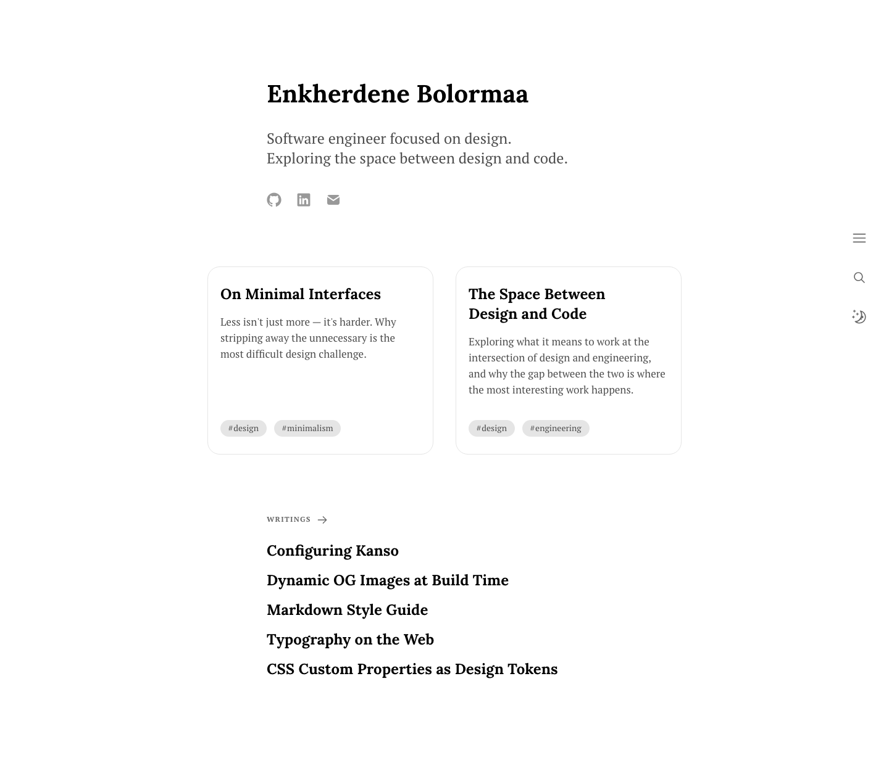
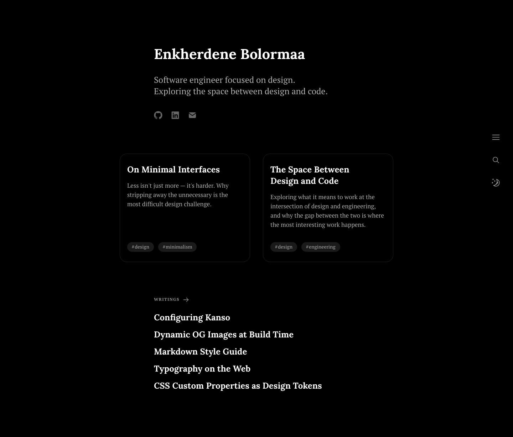

# Kanso

A minimal, content-focused writing theme for [Astro](https://astro.build). Designed for long-form writing with careful typography, dark mode, full-text search, and static OG image generation.

| Light                                               | Dark                                              |
| --------------------------------------------------- | ------------------------------------------------- |
|  |  |

## Features

- Minimal design focused on reading and writing
- Light/dark theme toggle with system preference detection
- Full-text static search via [Pagefind](https://pagefind.app)
- Dynamic OG image generation at build time (SVG → Sharp, no headless browser)
- RSS feed and sitemap
- Tag-based content organisation
- Syntax highlighting with [Expressive Code](https://expressive-code.com) (Catppuccin themes)
- MDX support with custom components
- 100/100 Lighthouse scores
- Deployed to GitHub Pages

## Project Structure

```text
src/
├── assets/
│   ├── icons/          # SVG icons (imported via ?raw)
│   └── og/             # OG image template, fonts, fonts.conf
├── components/         # Astro components
├── content/
│   └── writing/        # .md / .mdx writing files
├── pages/              # Astro pages and API routes
├── styles/             # global.css, reset.css
└── utils/              # data.ts, og-image.ts
```

## Commands

| Command              | Action                                                             |
| :------------------- | :----------------------------------------------------------------- |
| `npm install`        | Install dependencies                                               |
| `npm run dev`        | Start dev server at `localhost:4321`                               |
| `npm run dev:search` | Build + copy Pagefind index + start dev server (search functional) |
| `npm run build`      | Type-check, build, and index for search                            |
| `npm run preview`    | Preview production build locally                                   |
| `npm run clean`      | Remove `dist/`, `.astro/`, `public/pagefind/`                      |
| `npm run format`     | Format all files with Prettier                                     |
| `npm run lint`       | Run ESLint                                                         |
| `npm run lighthouse` | Lighthouse audit (pass `-- --build` to build first)                |

## Configuration

Personalise the theme by editing these files:

- **`src/constants.ts`** — site title, description, author, social links, display limits, about page content (experience + projects)
- **`astro.config.mjs`** — production `site` URL and `base` path
- **`ec.config.mjs`** — code block themes and font
- **`src/content/writing/`** — your writing files (`.md` / `.mdx`)

See [`configuring-kanso`](src/content/writing/configuring-kanso.md) for a full walkthrough.

## Writing Frontmatter

```md
---
title: "Your Post Title"
description: "One-sentence description."
pubDatetime: 2026-01-15T00:00:00.000Z
tags: ["guide", "astro"]
featured: true # optional — pins to homepage featured section
draft: false # optional — excludes from all listings
---
```

Tags must be lowercase letters and hyphens only (e.g. `design-systems`).

## Deployment

Configured for GitHub Pages via GitHub Actions (`.github/workflows/deploy.yml`). Set `site` and `base` in `astro.config.mjs` to match your repository, then push to `main`.
